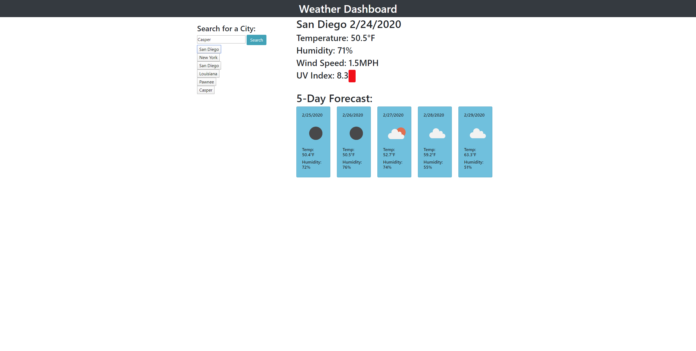

I created a weather app that takes user input to display the 5 day forcast of that town. The webpage will refresh the information with each new input, and save the inputs to local storage for the next time the page is opened.
The page displays the current date you are accessing it as well as displaying the next five days and an icon depicting the kind of weather.
There is also a color coding that goes along with the uv index to warn the user of the severity.

This page was created using the  OpenWeather api as well as the Moment.js api.
